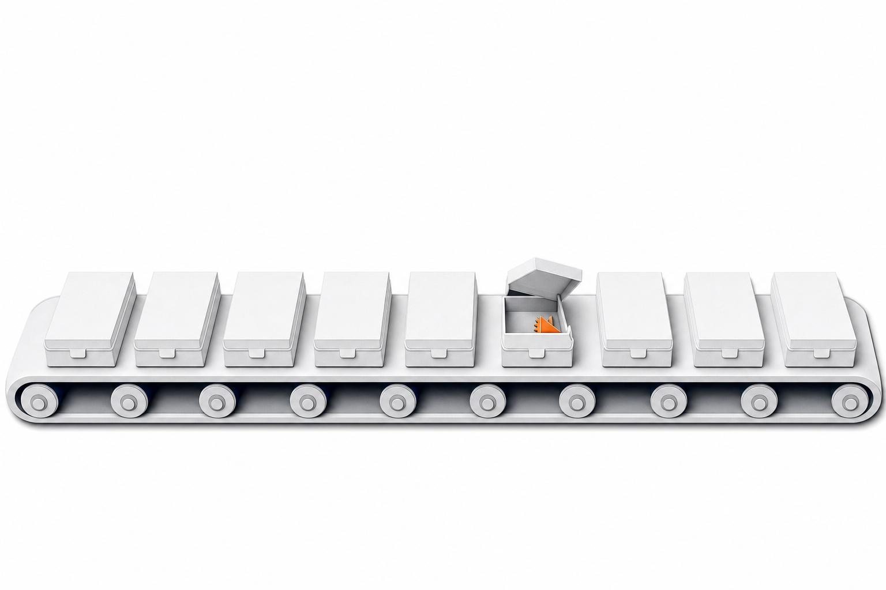
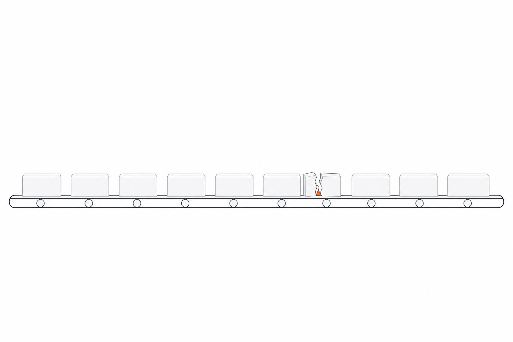
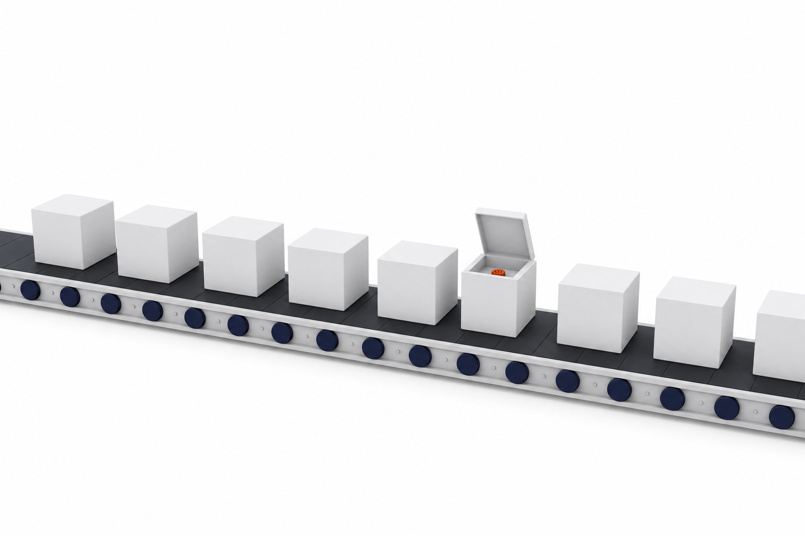

# CONVEYOR concept candidates

Slide: **The typing is hiding a decision.**  
Concept: a horizontal row of identical, interchangeable work blocks on a conveyor; exactly one block cracked/lifted open to reveal a tiny RFF Orange (#FF5219) wedge/gear. Everything else neutral.

Generated with `scripts/gen_image.py --model gpt-image-2 --size 1536x1024 --quality high`.

## conveyor-1.png — Isometric paper-cut

**Prompt (verbatim):**

> Editorial isometric paper-cut illustration on a pure white background (#FFFFFF). A single long horizontal conveyor belt runs across the lower two-thirds of the frame, carrying a row of nine identical, interchangeable rectangular blocks, evenly spaced, like repetitive typing tasks moving along a line. Blocks are layered cut paper in light gray #F5F5F7 with edges in line gray #E0E0E0 and soft dark shadows in #272B33; the belt and rollers are the same neutral grays with a hint of navy #050B46 in the deepest shadow. Exactly one block, slightly right of center, has its lid cracked and lifted open on a hinge, and inside sits one tiny bright orange wedge (#FF5219), a small gear-like sliver, very small relative to the block and belt; it is the only color in the whole image. Every other block is closed and identical. Flat, clean, minimal, Stripe or Linear marketing page aesthetic, matte paper texture, no gradients-heavy AI-art look, not photorealistic. The upper third of the frame is empty white negative space for a title. No text, no letters, no watermark, no numbers, no people, no faces, no robots, no brains, no lightbulbs, no clip art. Brand colors only: white #FFFFFF, light gray #F5F5F7, line gray #E0E0E0, dark #272B33, navy #050B46, and a single accent of RFF Orange #FF5219 for the hidden decision and nothing else colorful.

**Assessment:** Works: the lifted hinged lid and the tiny orange gear read instantly at a glance and the ~45% empty top band leaves clean title room; fails slightly in that the render came out closer to soft 3D than cut paper, and the orange piece is a plain gear rather than a wedge.

## conveyor-2.png — Flat vector

**Prompt (verbatim):**

> Flat vector editorial illustration, strictly two-dimensional, on a pure white background (#FFFFFF). A thin horizontal conveyor belt line spans the width of the frame in the lower half, with small round rollers underneath, all drawn in line gray #E0E0E0 and dark #272B33 strokes. On the belt sit ten identical flat rectangular blocks in light gray #F5F5F7 with #E0E0E0 outlines, evenly spaced, perfectly interchangeable, like a row of repetitive typing tasks. Exactly one block, just right of center, is split open with a clean crack, its two halves parted slightly to reveal one tiny bright orange wedge (#FF5219) inside, a small triangular sliver or minimal gear tooth, much smaller than the block; it is the only color anywhere. Simple geometric shapes, uniform stroke weight, no shading, no gradients, no texture, no photorealism, Stripe or Linear marketing illustration style. Generous empty white space across the top third for a title. No text, no letters, no watermark, no numbers, no people, no faces, no robots, no brains, no lightbulbs, no clip art. Brand colors only: white #FFFFFF, light gray #F5F5F7, line gray #E0E0E0, dark #272B33, navy #050B46, and a single accent of RFF Orange #FF5219 for the hidden decision and nothing else colorful.

**Assessment:** Works: it is the most on-brand for a Stripe/Linear look and the crack-with-a-sliver-of-orange is the most literal 'hidden decision' of the three; fails because the belt is so thin and low that the composition feels sparse and the orange wedge is almost too small to register from the back of a room.

## conveyor-3.png — Subtle 3D matte

**Prompt (verbatim):**

> Subtle 3D matte render, soft studio lighting, on a seamless pure white background (#FFFFFF). A long horizontal conveyor belt crosses the lower two-thirds of the frame at a gentle three-quarter angle, carrying eight identical matte cube-like blocks in light gray #F5F5F7, evenly spaced and perfectly interchangeable, like repetitive typing tasks on a production line. The belt surface is dark #272B33 with rollers in navy #050B46 and light edges in line gray #E0E0E0. Exactly one block, slightly right of center, has its top face lifted open like a hatch, revealing one tiny bright orange wedge (#FF5219), a small gear-like chip, sitting inside; it is very small relative to the block and belt and is the only color in the image. Clean matte clay materials, soft ambient occlusion, no reflections, no glossy surfaces, no lens flare, no gradients-heavy AI-art look, not photorealistic, restrained editorial feel like a Stripe or Linear marketing page. The upper third of the frame stays empty white for a title. No text, no letters, no watermark, no numbers, no people, no faces, no robots, no brains, no lightbulbs, no clip art. Brand colors only: white #FFFFFF, light gray #F5F5F7, line gray #E0E0E0, dark #272B33, navy #050B46, and a single accent of RFF Orange #FF5219 for the hidden decision and nothing else colorful.

**Assessment:** Works: the three-quarter perspective gives the belt real length and the open hatch with a small orange chip reads well; fails because the belt runs off both edges (no start/end), the navy rollers add a second strong color that competes with the orange, and the top-third is less cleanly empty than the other two.

## Recommendation

conveyor-1.png is the strongest first pick: single accent color, clean top negative space, and the hinged lid + small gear reads at slide distance. conveyor-2.png is the purest brand match if the belt is scaled up ~1.5x or cropped tighter.
